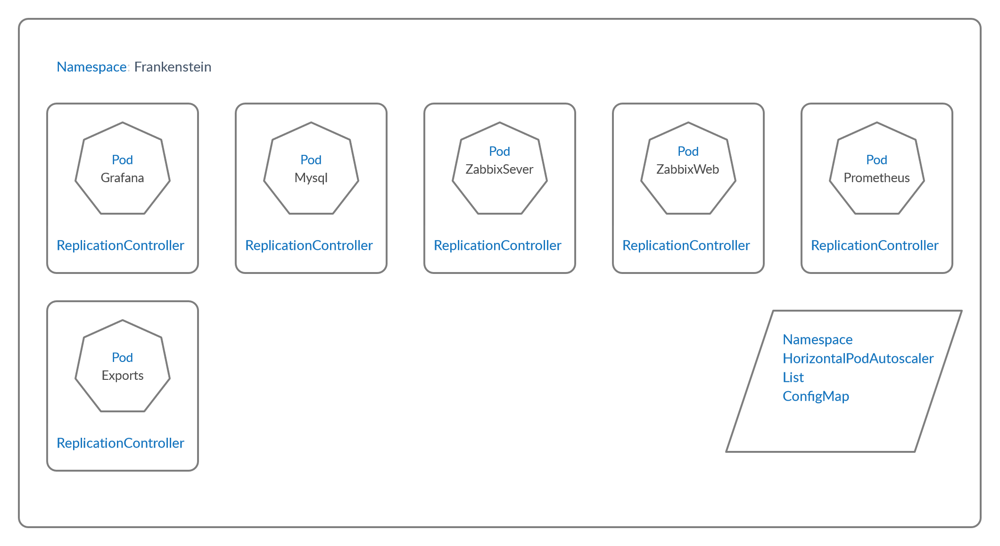

# Frankenstein




## Path's
```
# mkdir /MYSQL

# mkdir -p /zbx_env/usr/lib/zabbix/alertscripts \
  /zbx_env/usr/lib/zabbix/externalscripts \
  /zbx_env/var/lib/zabbix/modules \
  /zbx_env/var/lib/zabbix/enc \
  /zbx_env/var/lib/zabbix/snmptraps \
  /zbx_env/var/lib/zabbix/mibs \
  /zbx_env/var/lib/zabbix/export

# mkdir -p /Gf/storage \
  /Gf/datasources \
  /Gf/dashboards

# chown -R 472:472 /Gf
```
